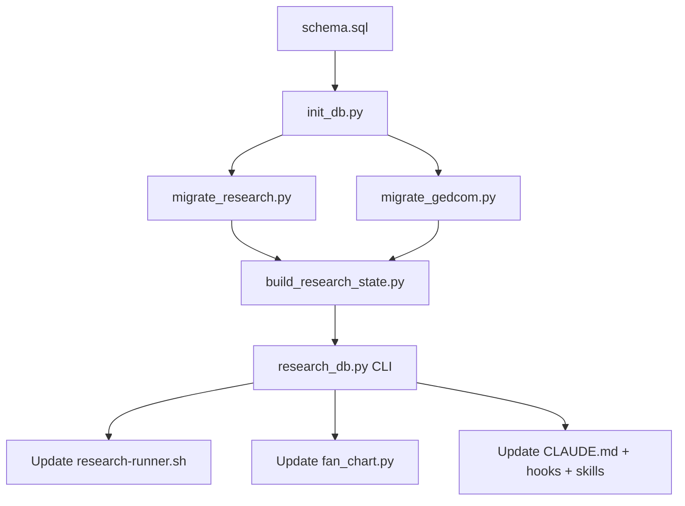

# SQLite Migration: Research State Database

## Context

Each autonomous `claude -p` research session reads FINDINGS.md (~452K tokens)
and RESEARCH_QUEUE.md (~47K tokens) at startup. With 10-20 sessions per run,
that's ~5M wasted tokens on re-reading state. The fix: a SQLite database with
targeted queries returning ~2-5K tokens per session instead of ~500K.

No rogue DB or prototype scripts exist — this is a clean start.

## Dependency graph



## Files to create (6)

### 1. `scripts/schema.sql`

DDL with PRAGMAs (WAL, foreign_keys, busy_timeout=5000). Tables:

- **persons** — GEDCOM cache (id, name, surname, sex, birth/death date/place/year, gedcom_blob)
- **families** — GEDCOM cache (id, husband_id, wife_id, marr_date/place, gedcom_blob)
- **family_children** — (family_id, child_id, sort_order)
- **sources** — GEDCOM cache (id, title, author, publication, gedcom_blob)
- **findings** — research findings (id, title, tier, status, date_found, queue_ref, raw_markdown, timestamps)
- **finding_persons** — M:N link (finding_id, person_id, role)
- **research_tasks** — queue items (id, title, priority, status, people_ids, goal, where_to_look, raw_markdown, timestamps)
- **task_runs** — session metrics (task_id, session_id, timestamps, token counts, summary, exit_reason)
- **person_research_state** — derived per-person summary (person_id, summary, best_tier, finding_count, open_questions)
- **findings_fts** — FTS5 virtual table on (title, raw_markdown) with INSERT/UPDATE/DELETE triggers

Indexes on: findings(tier), findings(status), finding_persons(person_id), research_tasks(status), persons(surname), persons(birth_year), family_children(child_id).

### 2. `scripts/init_db.py`

- Reads `scripts/schema.sql`, executes via `conn.executescript()`
- Sets PRAGMAs (WAL, foreign_keys, busy_timeout)
- `--reset` flag drops and recreates all tables
- Default DB path: `private/genealogy.db`
- Prints table list and row counts on success

### 3. `scripts/migrate_research.py`

Two parsers for the markdown files:

**FINDINGS.md parser:**
- Split on `^## F-\d+` headings
- Extract per block: id, title, person IDs (via `**Person:**`, `**Persons:**`, and fallback `(I\d+)` scan), tier, status (allow multi-word), date_found, queue_ref, raw_markdown
- Insert into `findings` + `finding_persons`

**RESEARCH_QUEUE.md parser:**
- Split on `^## RQ-\d+` headings
- Extract: id, title, priority, status, people_ids, goal, where_to_look, raw_markdown
- Insert into `research_tasks`

Validation: print counts, assert they match `grep -c` on source files.

### 4. `scripts/migrate_gedcom.py`

Import from `analyze_gedcom.py`: `parse_gedcom()`, `get_individuals()`, `get_families()`, `extract_field()`, `parse_year()`. Also need `extract_subfield()` for marriage data and source extraction.

Populate `persons`, `families`, `family_children`, `sources`. For `sources`, parse `0 @Sxxx@ SOUR` records extracting TITL, AUTH, PUBL. For `gedcom_blob`, join the raw lines.

Validate counts against `gedcom_query.py ids`.

### 5. `scripts/build_research_state.py`

For each person with findings: aggregate findings, pick best_tier, count them, generate 2-3 sentence summary, list open questions. For persons without findings but with GEDCOM gaps (missing birth/death dates, no sources): note what's missing.

`--person ID` flag for single-person incremental rebuild. Inserts/replaces `person_research_state`.

### 6. `scripts/research_db.py`

Central CLI, JSON output, 12 subcommands:

| Command | Purpose |
|---------|---------|
| `get-tasks [--limit N] [--status S]` | Active queue items |
| `get-person ID` | Person + findings + family + research state |
| `get-research-state ID` | Just the summary paragraph |
| `search QUERY [--limit N]` | FTS5 across findings |
| `add-finding JSON` | Insert finding + auto-link persons |
| `update-task ID --status S [--note T]` | Update queue item |
| `next-id [--type finding\|indi\|fam\|sour]` | Next available ID |
| `log-run JSON` | Record session metrics in task_runs |
| `stats` | Table counts, tier/status distribution |
| `sync-from-gedcom` | Refresh persons/families/sources from tree.ged |
| `sync-to-markdown` | Regenerate FINDINGS.md + RESEARCH_QUEUE.md from DB |
| `rebuild-research-state [--person ID]` | Recompute summaries |

DB path: `private/genealogy.db` (same default as init_db.py).

## Files to modify (9)

### 7. `scripts/research-runner.sh` (lines 121-206: RESEARCH_PROMPT)

Replace the embedded prompt's task section. Key changes:
- **Before:** "Read FINDINGS.md AND RESEARCH_QUEUE.md FIRST" (line 170)
- **After:** `python scripts/research_db.py get-tasks --limit 1` then `get-person <ID>` per target
- Phase 4 (Document): `research_db.py add-finding` and `update-task` instead of file append
- Add `python scripts/research_db.py sync-from-gedcom` before the main loop (after line 208)
- Replace `grep -cP '^## F-\d+' FINDINGS.md` (lines 211, 255, 271) with `research_db.py stats`
- Keep OUTPUT SUMMARY format (runner parses it)

### 8. `scripts/fan_chart.py`

Add `tiers_from_db(db_path)` function querying `finding_persons JOIN findings` for best tier per person. In `main()`, try DB first (`private/genealogy.db`), fall back to `parse_findings()` if DB missing. Add `--db` / `--no-db` flags.

Existing functions to preserve: `derive_tiers_from_gedcom()` (line 33), `parse_findings()` (line 80). The new DB path supplements these — GEDCOM-derived tiers remain the base layer, DB/FINDINGS overrides on top.

### 9. `CLAUDE.md`

- Add "Research Database" section near line 68 documenting `research_db.py` commands
- Update research workflow (around lines 84-89) to reference DB commands
- Update locking table (lines 142-155): remove FINDINGS.md row, note DB uses WAL
- Update autonomous research rules (lines 157+): "Write findings to DB via research_db.py"

### 10. `.claude/hooks/file-lock.sh`

Remove the `*FINDINGS.md)` case (line 18). Keep `*tree.ged)` lock. FINDINGS.md becomes a derived artifact regenerated via `sync-to-markdown`, no longer a concurrent-write target.

### 11-15. Skill files

| Skill file | Change |
|------------|--------|
| `.claude/skills/research/SKILL.md` | Phase 1 Assess: `get-tasks` + `get-person` instead of reading markdown files. Phase 4 Document: `add-finding` + `update-task`. Keep `gedcom_query.py` for Phase 3 GEDCOM edits. |
| `.claude/skills/research-unattended/SKILL.md` | Architecture diagram: state in `GEDCOM + genealogy.db`. Phase 4 consolidation: add `sync-to-markdown`. |
| `.claude/skills/harden/SKILL.md` | Step 3d Document: `add-finding` not file append |
| `.claude/skills/fan-chart/SKILL.md` | Tier derivation section: DB primary, FINDINGS.md fallback. Add `--db`/`--no-db` flags. |
| `.claude/skills/verify-scans/SKILL.md` | Step 1 collect pending: query DB for Tier C/D findings with scan URLs instead of parsing FINDINGS.md |

## Key design decisions

- **`raw_markdown` is canonical** in findings/research_tasks. Structured fields (tier, status, person_ids) are best-effort extractions. Parser improves over time without data loss.
- **No ORM, no new deps.** `sqlite3` stdlib + `sqlite3.Row` for dict access.
- **Reuse `analyze_gedcom.py` parsing** — import `parse_gedcom()`, `get_individuals()`, `get_families()`, `extract_field()`, `extract_subfield()`, `parse_year()`. No GEDCOM parser duplication.
- **GEDCOM stays as source of truth for the tree.** DB caches persons/families for queries. Agents still edit `tree.ged` directly. `sync-from-gedcom` refreshes the cache.
- **FTS5 with auto-sync triggers** on findings table — unlike manual sync approaches.
- **`person_research_state`** is fully derived and rebuildable. Gives agents ~200 tokens per person instead of reading all of FINDINGS.md.

## Execution order

```
Step 1:  Create schema.sql
Step 2:  Create init_db.py → verify it runs (creates empty DB)
Step 3:  Create migrate_research.py → run → validate counts vs grep
Step 4:  Create migrate_gedcom.py → run → validate counts vs gedcom_query.py ids
Step 5:  Create build_research_state.py → run → validate
Step 6:  Create research_db.py → test all 12 subcommands
Step 7:  Round-trip test: sync-to-markdown → diff against originals
Step 8:  Update research-runner.sh prompt + counting logic
Step 9:  Update fan_chart.py with DB tier source
Step 10: Update CLAUDE.md, file-lock.sh, 5 skill files
Step 11: Delete nothing (no rogue files exist)
Step 12: End-to-end: simulate session boot with get-tasks + get-person
```

Steps 1-2 are sequential. Steps 3-4 can run in parallel after 2. Step 5 depends on both 3 and 4. Steps 8-10 can run in parallel after 7.

## Verification

### Data integrity (built into migration scripts)
- Row counts match `grep -c` on source files
- No NULL `raw_markdown` or `id` values
- All person_ids in `finding_persons` match `I\d+` format
- `person_research_state.finding_count` matches actual join counts

### Round-trip test
```bash
cp private/research/FINDINGS.md /tmp/FINDINGS_original.md
python scripts/research_db.py sync-to-markdown
diff <(sed 's/[[:space:]]*$//' /tmp/FINDINGS_original.md) \
     <(sed 's/[[:space:]]*$//' private/research/FINDINGS.md)
# Only cosmetic whitespace diffs allowed
```

### CLI smoke tests
```bash
python scripts/research_db.py get-tasks --limit 3 | python -m json.tool
python scripts/research_db.py get-person I0067 | wc -c   # < 12000 chars
python scripts/research_db.py search "Scottish" | python -m json.tool
python scripts/research_db.py next-id --type finding
python scripts/research_db.py stats
```

### Fan chart parity
```bash
python scripts/fan_chart.py --no-db -o /tmp/fan_old.svg
python scripts/fan_chart.py --db -o /tmp/fan_new.svg
# Colors should match
```

### Simulated session boot
```bash
python scripts/research_db.py get-tasks --limit 1
python scripts/research_db.py get-person I501685
# Output should be < 3K tokens (~12K chars)
```

## Concurrency

- **WAL mode** allows concurrent reads (babysitter + workers)
- **Writers** are sequential (runner launches one session at a time)
- **sync-from-gedcom** runs once before a research run, not per session. Full clear + repopulate — must not run while sessions are active.
- **tree.ged** keeps existing file lock
- **FINDINGS.md lock removed** — now a derived artifact

## Rollback

Markdown files are never deleted during migration. Full rollback:
```bash
rm private/genealogy.db
git checkout HEAD -- scripts/   # restore pre-migration scripts
# FINDINGS.md and RESEARCH_QUEUE.md are untouched
```

**Safety invariant:** DB is regenerable from markdown + GEDCOM. Markdown is regenerable from DB. Neither direction loses data.